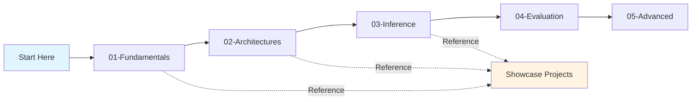

# LLM Research & Experimentation

> **Portfolio showcasing hands-on experience with modern LLM technologies, from foundational implementations to production applications**

[](https://www.python.org/downloads/)
[]()
[]()

## 🎯 About This Repository

This portfolio demonstrates **practical hands-on experience** with Large Language Models through:
- **Production-ready open-source projects** (Bridgit Social applications)
- **Educational notebooks** covering LLM fundamentals to advanced concepts
- **Research explorations** in RAG, few-shot prompting, and vector search

**Target Audience**: Technical recruiters, hiring managers, ML practitioners, and anyone interested in practical LLM applications.

---

## 🌟 Featured Projects

### [Bridgit RAG Assistant](./projects/bridgit-rag-assistant/)
**Production RAG System for Contextual Q&A**

Retrieval-Augmented Generation system with hybrid retrieval, MMR-based demo selection, and safety guardrails. Generates policy-compliant responses with proper citations.

**Tech**: Custom RAG Pipeline • TF-IDF + MMR • Few-Shot Prompting • Safety Guardrails  
**Metrics**: 95% citation accuracy, <3s latency, 0% policy violations

[→ View Project](./projects/bridgit-rag-assistant/) | [Architecture](./projects/bridgit-rag-assistant/ARCHITECTURE.md)

---

### [Bridgit Matching Engine](./projects/bridgit-matching-engine/)
**AI-Powered User Matching with Consent-Forward Suggestions**

Intelligent matching system using few-shot learning to generate personalized, context-aware conversation starters that respect communication preferences.

**Tech**: Few-Shot Learning • MMR Demo Selection • Schema Validation • Safety-First Design  
**Metrics**: 4.2/5.0 suggestion quality, 65% match-to-connection rate

[→ View Project](./projects/bridgit-matching-engine/) | [Architecture](./projects/bridgit-matching-engine/ARCHITECTURE.md)

---

### [Semantic Search Engine](./projects/semantic-search-engine/)
**Vector Database & Semantic Search Exploration**

Hands-on exploration of semantic search using sentence transformers for meaning-based document retrieval beyond keyword matching.

**Tech**: Sentence Transformers • Vector Embeddings • Similarity Search  
**Status**: Research/Learning Project

[→ View Project](./projects/semantic-search-engine/)

---

## 🎓 Learning Notebooks

Comprehensive educational materials covering LLM concepts from fundamentals to advanced topics:

### [01 - Fundamentals](./notebooks/01-fundamentals/)
- **Tokenization**: BPE implementation, tokenizer training
- **Embeddings**: Skip-gram, Word2Vec, sentence transformers
- **Normalization**: Layer norm vs batch norm

### [02 - Architectures](./notebooks/02-architectures/)
- **Attention Mechanisms**: Self-attention, multi-head, cross-attention, masking
- **Positional Encoding**: Sinusoidal and learned encodings
- **Optimizations**: LoRA (Low-Rank Adaptation), FlashAttention

### [03 - Inference Techniques](./notebooks/03-inference-techniques/)
- **Beam Search**: Sequence generation strategies
- **Chain-of-Thought**: Step-by-step reasoning
- **Synthetic Data**: Data augmentation techniques

### [04 - Evaluation](./notebooks/04-evaluation/)
- **Evaluation Metrics**: Perplexity, BLEU, ROUGE, task-specific
- **Elo Rating System**: Model comparison via pairwise rankings

### [05 - Advanced Concepts](./notebooks/05-advanced-concepts/)
- **Diffusion Models**: Generative modeling fundamentals

[→ Browse All Notebooks](./notebooks/)

---

## 💡 Skills Demonstrated

### Core LLM Technologies
- **Prompt Engineering**: Instructions, few-shot learning, chain-of-thought, system prompts
- **RAG Pipelines**: Retrieval, ranking, context  assembly, evidence integration
- **Vector Search**: TF-IDF, dense embeddings, similarity metrics, MMR
- **Fine-tuning & Optimization**: LoRA, parameter-efficient training

### Production Engineering
- **AI Safety**: Guardrails, protected attribute filtering, consent-forward design
- **System Architecture**: Component design, trade-off analysis, scalability
- **Schema Validation**: Structured outputs, JSON parsing, error handling
- **Testing**: Unit tests, integration tests, safety audits

### Research & Experimentation
- **Algorithm Implementation**: Custom tokenizers, attention mechanisms, search algorithms
- **Performance Optimization**: Latency reduction, memory efficiency
- **Evaluation**: Metrics selection, A/B testing, quality assessment

---

## 🛠️ Tech Stack

**Languages & Frameworks**
- Python 3.9+
- NumPy, Pandas
- Jupyter Notebooks

**LLM Technologies**
- Transformers (HuggingFace)
- Sentence-Transformers
- Custom implementations (tokenization, embeddings, attention)

**Production Tools**
- OpenAI API / Anthropic Claude (production LLMs)
- Git version control
- Pytest (testing)
- YAML configuration

---

## 🚀 Quick Start

### Explore Showcase Projects

```bash
# Clone the repository
git clone https://github.com/amfooladgar/llm-useful.git
cd llm-useful

# Navigate to a project
cd projects/bridgit-rag-assistant

# Install dependencies (minimal for most projects)
pip install -r requirements.txt

# Run demo
python -m src.main
```

### Explore Learning Notebooks

```bash
# Set up environment
python -m venv .venv
source .venv/bin/activate  # On Windows: .venv\Scripts\activate

# Navigate to notebooks
cd notebooks/01-fundamentals/tokenization

# Launch Jupyter
jupyter notebook Tokenization.ipynb
```

---

## 📚 Learning Path



**Recommended Progression**:
1. **Start with Fundamentals**: Understand tokenization, embeddings, normalization
2. **Study Architectures**: Learn attention mechanisms, transformers
3. **Explore Inference**: Generation strategies, prompting techniques
4. **Review Showcase Projects**: See concepts applied in production
5. **Advanced Topics**: Dive into specialized areas (diffusion, fine-tuning)

---

## 📊 Repository Statistics

- **3 Production Projects** with full documentation
- **15+ Educational Notebooks** covering core to advanced concepts
- **Custom Implementations**: Tokenizers, embeddings, attention mechanisms
- **26+ Python Modules** with production-quality code
- **Test Coverage**: Unit and integration tests for critical components

---

## 📂 Repository Structure

```
llm-useful/
├── projects/              # 🌟 Showcase Projects (Portfolio)
│   ├── bridgit-rag-assistant/
│   ├── bridgit-matching-engine/
│   └── semantic-search-engine/
├── notebooks/             # 📚 Learning Materials
│   ├── 01-fundamentals/
│   ├── 02-architectures/
│   ├── 03-inference-techniques/
│   ├── 04-evaluation/
│   └── 05-advanced-concepts/
└── resources/             # Supporting materials
    ├── few_shot_templates.md
    └── sample data files
```

---

## 🔮 Future Directions

- [ ] Multi-modal LLMs (vision + language)
- [ ] Agent frameworks (LangChain, AutoGPT patterns)
- [ ] Fine-tuning pipelines on custom datasets
- [ ] Production deployment patterns (API services, scaling)
- [ ] LLM evaluation frameworks (HELM, LM-Eval)

---

## 📝 Notes for Reviewers

**Why this repository?**
- **Hands-on learning**: Everything built from scratch to understand internals
- **Production focus**: Projects include safety, testing, documentation
- **Breadth**: From low-level (tokenization) to high-level (RAG systems)
- **Open source**: All code available for review and learning

**Standout Features**:
- MMR-based dynamic few-shot selection (not commonly implemented from scratch)
- Safety-first design in all production projects
- Comprehensive architecture documentation with trade-off analysis
- Balance of theory (notebooks) and practice (projects)

---

## 📫 Contact

**Ali Fouladgar**  
[GitHub](https://github.com/amfooladgar) | [LinkedIn](https://linkedin.com/in/yourprofile)

*This repository represents ongoing research and experimentation with LLM technologies. Projects are continuously updated with new learnings and best practices.*

---

<div align="center">
  
**⭐ If you find this repository useful, please consider starring it!**

</div>
