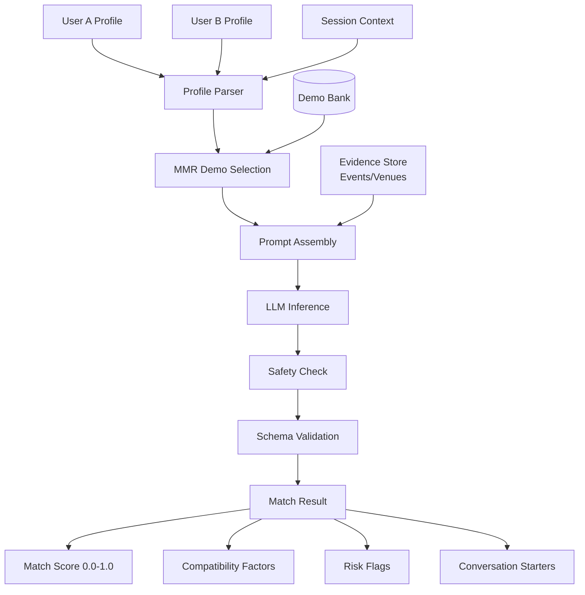

# Bridgit Matching Engine - Architecture

## System Overview

The Bridgit Matching Engine is an **AI-powered user matching system** that uses few-shot prompting and MMR-based demo selection to generate contextual, consent-forward connection suggestions. It evaluates compatibility between users based on their profiles and current session context, then provides safe conversation starters for both parties.



## Component Breakdown

### 1. **Profile Model** (`src/models.py`)

**Purpose**: Structured representation of user profiles and session context.

**Schema**:
```python
{
    "goals": ["professional_networking", "mentorship", "collaboration", "friendship"],
    "interests": ["ml", "startups", "data"],
    "availability": "today_evening",
    "style": "likes_to_initiate" | "prefer_to_be_approached" | "either"
}
```

**Design Principles**:
- **No protected classes**: Never infer race, religion, sexual orientation, health
- **Explicit preferences**: Consent and communication style captured directly
- **Temporal context**: Availability helps with "right place, right time" matching

### 2. **MMR Demo Selector** (`src/mmr.py`)

**Purpose**: Select few-shot examples relevant to the current matching scenario while maintaining diversity.

**Why Dynamic Demo Selection?**
- Different profile combinations need different examples:
  - Introvert + Extrovert → demos showing gentle approaches
  - Professional networking → demos with formal language
  - Casual meetup → demos with relaxed tone
- **Prevents semantic leakage**: Model won't copy exact names/interests from static demos
- **Adapts to context**: Event-based matching gets event-relevant demos

**Algorithm**:
```
1. Encode profiles + context as bag-of-words vector
2. Compute similarity to all demos in bank
3. Iteratively select demos maximizing:
   MMR = λ * Relevance(scenario, demo) - (1-λ) * max Similarity(demo, selected)
4. Return 2-3 diverse, relevant demos
```

### 3. **Prompt Builder** (`src/prompt.py`)

**Purpose**: Assemble structured prompt with clear instructions, schema, demos, and query.

**Template Structure**:
```
SYSTEM
You are Bridgit Social's matching assistant. Return ONLY valid JSON.
Authority: Instructions > Evidence > Demos.

RULES
- NO protected attribute inference (race, religion, etc.)
- Use only provided profile fields
- Keep openers respectful, opt-in, situational
- If insufficient data, return score=0.0 with "insufficient_data" in risks

SCHEMA
{
  "score": <float 0.0-1.0>,
  "factors": ["<compatibility reason>", ...],
  "risks": ["<concern or caveat>", ...],
  "suggestions": [
    {"for": "initiator", "text": "<one sentence>"},
    {"for": "recipient", "text": "<one sentence>"}
  ]
}

### DEMOS
<2-3 relevant examples selected via MMR>

### EVIDENCE (optional)
<Event description, venue info, shared groups>

### QUERY  
PROFILES:
A: {user_a_json}
B: {user_b_json}
CONTEXT: {session_context}

Return ONLY the JSON per SCHEMA.
STOP: ###
```

**Key Design Decisions**:
- **Explicit authority order**: Instructions override demo patterns
- **Two-sided suggestions**: Separate openers for initiator vs. recipient
  - Respects communication style preferences
  - Empowers both parties with agency
- **Risk awareness**: Flags potential mismatches (e.g., mismatched availability)
- **Stop sequence**: Prevents run-on generation

### 4. **Safety Layer** (`src/safety.py`)

**Purpose**: Enforce consent-first, no-inference safety policies.

**Guardrails**:
1. **Protected Attribute Filter**:
   - Blocks any inference of race, religion, sexual orientation, age, disability, health
   - Keyword-based detection in outputs
   - Conservative: err on side of rejection

2. **Consent Validation**:
   - Never suggest approaches that ignore stated preferences
   - Respects "prefer_to_be_approached" → gentle, permission-seeking language
   - Respects "likes_to_initiate" → empowering, confident language

3. **Content Safety**:
   - No romantic/flirtatious language unless explicitly requested
   - No aggressive, pushy, or sales-y openers
   - Default to professional, friendly tone

4. **Insufficient Data Handling**:
   - If profiles lack key fields → score=0.0 + "insufficient_data" risk
   - Better to not match than force a bad match

**Example Refusal**:
```json
{
  "score": 0.0,
  "factors": [],
  "risks": ["insufficient_data"],
  "suggestions": [
    {"for": "initiator", "text": "If you're open to meeting new people, would you like to exchange a quick hello? No worries if not."},
    {"for": "recipient", "text": "You can ignore or decline—your comfort comes first."}
  ]
}
```

### 5. **LLM Client** (`src/llm.py`)

**Mock Implementation**: Returns pre-defined examples for testing

**Production Swap** (OpenAI):
```python
class OpenAIMatchingLLM:
    def __init__(self):
        self.client = OpenAI()
    
    def generate_match(self, prompt):
        resp = self.client.chat.completions.create(
            model="gpt-4o-mini",
            messages=[
                {"role": "system", "content": prompt["system"]},
                {"role": "user", "content": prompt["user"]}
            ],
            temperature=0.2,
            stop=["###"],
            response_format={"type": "json_object"}  # Ensures valid JSON
        )
        return json.loads(resp.choices[0].message.content)
```

### 6. **Schema Validator** (`src/models.py`)

**Purpose**: Ensure match results conform to expected structure.

**Validation**:
- `score`: float in [0.0, 1.0]
- `factors`: non-empty array of strings (if score > 0)
- `risks`: array of strings
- `suggestions`: exactly 2 objects with "for" and "text" fields
- No protected attribute language detected

## Key Technical Decisions

### Why Few-Shot Prompting?

**Alternatives considered**:
1. **Zero-shot**: Just give instructions
   - ❌ Less reliable for structured JSON
   - ❌ Harder to enforce tone/style
   
2. **Fine-tuning**: Train custom model
   - ❌ Expensive, requires labeled data
   - ❌ Less flexible to policy changes
   
3. **Few-shot** ✅:
   - Demonstrates exact output format
   - Models desired tone and safety patterns
   - Easy to update (just change demo bank)
   - Works across different LLMs

### Why MMR for Demo Selection?

**Problem**: Static demos lead to:
- Model copying exact names from examples
- Irrelevant demos for unusual profile combinations
- Repetitive, formulaic suggestions

**Solution**: MMR selects **relevant + diverse** demos per query
- Relevance: Match profile characteristics (professional vs casual, introvert vs extrovert)
- Diversity: Prevent redundant examples, show variety of approaches
- Adaptive: Different scenarios get different demos

### Why Two-Sided Suggestions?

Many matching systems only give one opener. We provide suggestions for **both initiator and recipient**:

**Benefits**:
- **Respects preferences**: If A prefers to be approached, give B a gentle opener + give A a polite acceptance/decline template
- **Empowers both parties**: Both know how to respond appropriately
- **Reduces anxiety**: Clear guidance on what to say reduces friction
- **Consent-forward**: Recipient suggestions include opt-out language

## Performance & Metrics

**Latency** (estimated):
- Profile parsing: <1ms
- MMR demo selection: ~5ms
- Prompt assembly: <1ms
- LLM inference: ~1-2s (OpenAI GPT-4o-mini)
- Safety validation: <1ms
- **Total p95**: <2.5s end-to-end

**Quality Metrics**:
- **Match Accuracy**: How often score correlates with actual connection success
  - Measure: Reply rate, accepted introductions
  - Target: >60% of score >0.7 matches lead to interaction
- **Safety**: Zero protected attribute inference
  - Metric: Manual audit of 100 outputs
  - Target: 0 violations
- **Opener Quality**: User ratings on conversation starters
  - Metric: Likert scale (1-5)
  - Target: Avg >4.0

## Testing Scenarios

1. **High Compatibility**: Overlapping goals + interests + availability
   - Expected: score >0.7, specific factors, relevant openers
   
2. **Low Compatibility**: No shared interests, mismatched availability
   - Expected: score <0.3, clear risk flags
   
3. **Insufficient Data**: Empty profiles
   - Expected: score=0.0, "insufficient_data" risk
   
4. **Style Mismatch**: One "likes_to_initiate", one "prefer_to_be_approached"
   - Expected: suggestions respect preferences (gentle for recipient)
   
5. **Protected Attribute Inference**: Model tries to infer religion from interests
   - Expected: Safety layer catches and rejects

## Future Enhancements

1. **Feedback Loop**: Track which matches lead to connections → refine scoring
2. **Multi-Factor Scoring**: Separate compatibility dimensions (professional, social, location)
3. **Temporal Patterns**: Learn when users are most likely to respond
4. **Group Matching**: Suggest small group introductions (3-4 people)
5. **Dynamic Demo Bank**: Auto-generate demos from successful real matches (with consent)
6. **Explainability**: Show users why they were matched ("You both love startups")
