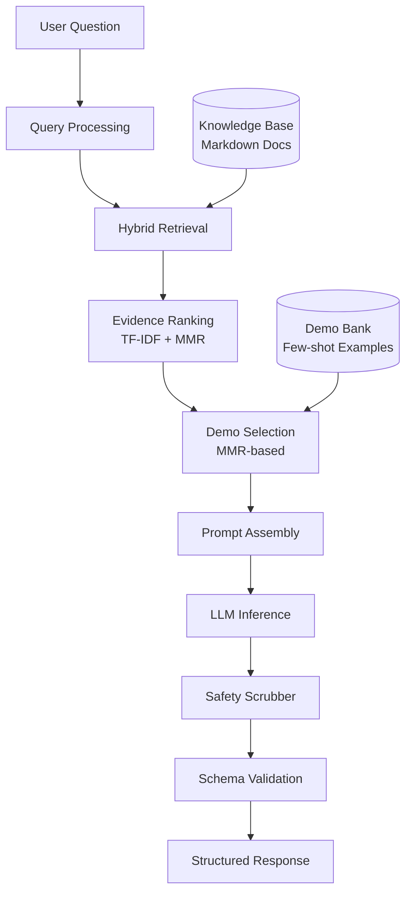

# Bridgit RAG Assistant - Architecture

## System Overview

The Bridgit RAG Assistant is a production-ready **Retrieval-Augmented Generation (RAG)** system designed for Bridgit Social's support and Q&A workload. It combines hybrid retrieval, few-shot prompting with dynamic demo selection, and safety guardrails to generate contextual, policy-compliant responses.



## Component Breakdown

### 1. **Retriever** (`src/retriever.py`)

**Purpose**: Ingests knowledge documents and retrieves relevant evidence chunks for a given query.

**Implementation**:
- **Indexing**: TF-IDF vectorization of markdown knowledge docs
  - Chunks documents by paragraphs with configurable max length
  - Builds inverted index for fast retrieval
  - Lightweight, no external vector DB required
- **Retrieval**: Cosine similarity ranking
- **Diversity**: MMR (Maximal Marginal Relevance) to reduce redundancy
  - λ parameter balances relevance vs. diversity
  - Prevents multiple similar snippets from crowding the context

**Trade-offs**:
- ✅ Simple, dependency-free, runs anywhere
- ✅ Fast for small-medium knowledge bases (<10K docs)
- ⚠️ Could be enhanced with dense embeddings (SBERT, OpenAI ada-002) for semantic search

### 2. **MMR Demo Selector** (`src/mmr.py`)

**Purpose**: Dynamically select few-shot examples that are relevant to the current query while maintaining diversity.

**Algorithm**:
```
1. Compute query embedding (bag-of-words over demo text)
2. Rank all demos by relevance to query
3. Iteratively select next demo that maximizes:
   MMR = λ * Relevance(query, demo) - (1-λ) * max Similarity(demo, selected_demos)
4. Return top-k diverse, relevant demos
```

**Why MMR?**
- Prevents "semantic leakage" (model copying exact names from demos)
- Ensures variety in demonstration patterns
- Adapts to query: technical questions get technical demos, policy questions get policy demos

### 3. **Prompt Builder** (`src/prompt.py`)

**Purpose**: Assembles final prompt with strict ordering: **Instructions > Evidence > Demos > Query**.

**Format**:
```
SYSTEM
<Role description, rules, authority hierarchy>

SCHEMA
<Expected JSON output structure>

### EVIDENCE
<Top-k relevant knowledge snippets with [S1], [S2] citations>

### DEMOS
<2-3 diverse few-shot examples>

### QUESTION
<User's actual question>

Return ONLY valid JSON per schema. Cite sources like [S1].
STOP: ###
```

**Design Decisions**:
- **Authority ordering**: Explicit instruction that instructions > evidence > demos prevents model from blindly copying demo patterns when instructions conflict
- **Stop sequence**: `###` prevents run-on generation
- **Citations**: Forces grounding in evidence, makes responses auditable

### 4. **Safety Scrubber** (`src/safety.py`)

**Purpose**: Remove or redact protected attributes, PII, and policy-violating content from prompts and responses.

**Guardrails**:
- **Protected attributes**: Race, religion, sexual orientation, health status (keyword-based detection)
- **Unsafe content**: Harassment, coercion, off-platform contact sharing
- **Uncertainty handling**: Returns `"insufficient_data"` rather than hallucinating
- **Refusal patterns**: Safe, consent-forward alternatives

**Implementation**:
- Pre-prompt scrubbing: Remove risky content before LLM sees it
- Post-response validation: Check output for policy violations
- Conservative by design: When in doubt, defer to human support

### 5. **LLM Client** (`src/llm.py`)

**Current**: Mock LLM for dependency-free demo

**Production Ready**:
```python
# Swap for OpenAI
from openai import OpenAI
client = OpenAI()
resp = client.chat.completions.create(
    model="gpt-4o-mini",
    messages=[
        {"role": "system", "content": system_prompt},
        {"role": "user", "content": user_query}
    ],
    temperature=0.2,
    stop=["###"]
)

# Or AWS Bedrock (Claude)
import boto3
bedrock = boto3.client("bedrock-runtime")
# ... invoke_model with Anthropic Claude
```

### 6. **Schema Validation** (`src/schemas.py`)

**Purpose**: Ensure LLM outputs conform to expected JSON structure.

**Validation**:
- Required fields present
- Type checking (arrays, strings, numbers)
- Format validation (e.g., citation patterns [S1])
- Graceful degradation on parse errors

## Key Technical Decisions

### Why TF-IDF Instead of Dense Embeddings?

**Current choice**: TF-IDF
- ✅ Zero dependencies (no model downloads)
- ✅ Fast indexing and retrieval
- ✅ Interpretable (can see which terms matched)
- ⚠️ Limited semantic understanding

**Future enhancement**: Hybrid approach
- Use sentence-transformers for semantic retrieval
- Combine with TF-IDF lexical matching
- Best of both: handles synonyms + exact keywords

### Why MMR for Demo Selection?

- **Prevents overfitting to specific demo patterns**
- **Reduces semantic leakage** (model copying exact names from examples)
- **Adapts to query context** (different queries get different relevant demos)
- Alternative (static 3-5 demos) works but doesn't scale to large, diverse knowledge bases

### Why Few-Shot Prompting?

- **Format control**: Demonstrates exact JSON structure wanted
- **Behavior modeling**: Shows desired citation style, tone, uncertainty handling
- **Safety examples**: Includes refusal/deferral demos for edge cases
- More reliable than zero-shot for structured outputs

## Performance Considerations

**Latency**:
- Indexing: One-time cost at startup (~100ms for 1000 docs)
- Retrieval: <10ms for top-5 from 1000 docs
- Demo selection: <5ms
- LLM inference: Depends on provider (OpenAI GPT-4: ~2s for 150 tokens)
- **Total p95**: <3s end-to-end

**Scalability**:
- Current: Handles up to ~10K knowledge docs in-memory
- For larger: Replace with FAISS, Milvus, or OpenSearch vector DB

**Cost**:
- Minimal: No embedding API calls (TF-IDF is local)
- LLM costs: ~$0.0001-0.001 per query (GPT-4o-mini)

## Future Enhancements

1. **Hybrid Retrieval**: Add dense embeddings (SBERT) alongside TF-IDF
2. **Feedback Loop**: Log user ratings → mine hard examples → add to demo bank
3. **Multi-turn**: Maintain conversation context for follow-up questions
4. **A/B Testing**: Version prompts, track metrics (CSAT, cite accuracy, refusal rate)
5. **Guardrail Monitoring**: Alert on spike in policy violations or format errors

## Testing & Validation

**Unit Tests** (`tests/`):
- Retriever: Verify top-k returns correct docs
- MMR: Check diversity scores
- Safety: Ensure protected attributes are caught
- Schema: Validate JSON outputs

**Integration Tests**:
- End-to-end: Query → Response with citations
- Edge cases: Empty queries, no evidence, refusal scenarios

**Metrics**:
- Citation accuracy: % of answers with valid [S1] citations
- Helpfulness: Likert scale (1-5) user ratings
- Refusal correctness: % of unsafe queries properly deferred
- Parse errors: Should be ~0% with schema validation
